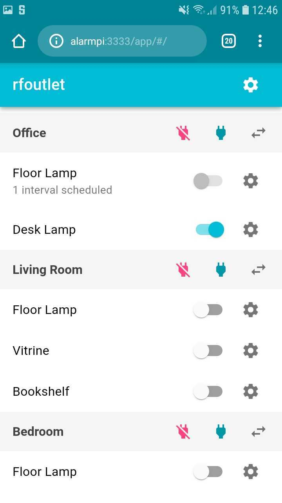
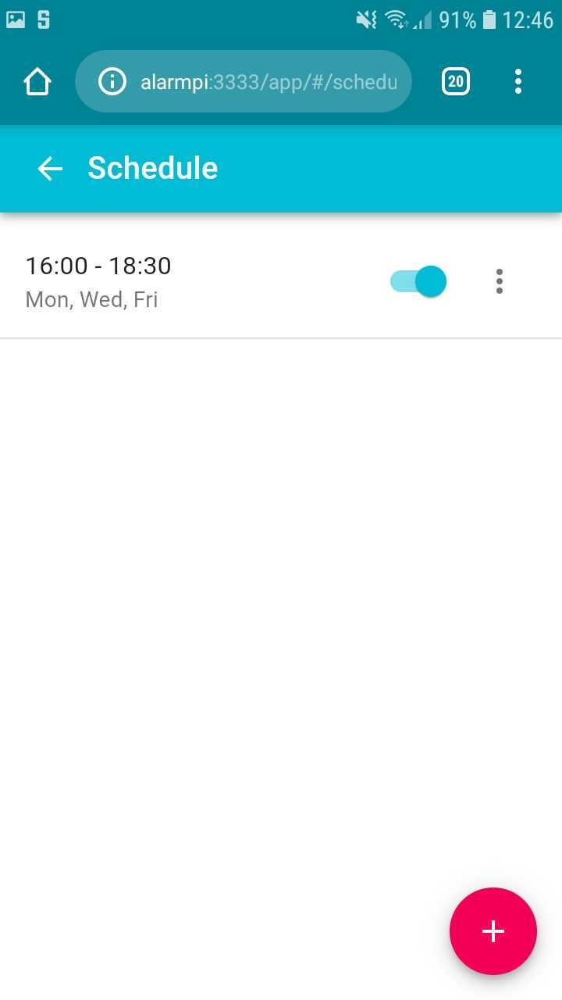
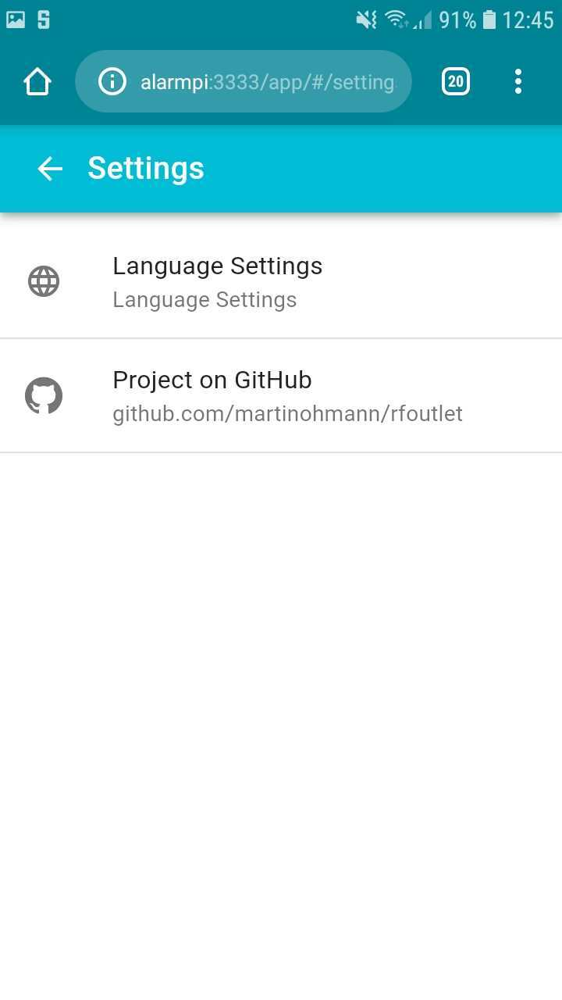

rfoutlet
========

[](https://travis-ci.org/martinohmann/rfoutlet)
[](https://codecov.io/gh/martinohmann/rfoutlet)
[](https://goreportcard.com/report/github.com/martinohmann/rfoutlet)
[](https://godoc.org/github.com/martinohmann/rfoutlet)

Outlet control via web interface for Raspberry PI 2/3. The transmitter and
receiver logic has been ported from the great
[rc-switch](https://github.com/sui77/rc-switch) C++ project to golang.


Contents
--------

- [Screenshots](#screenshots)
- [Stability note](#stability-note)
- [Breaking changes](#breaking-changes)
- [Prerequisites](#prerequisites)
- [Installation](#installation)
- [Commands](#commands)
- [Raspberry PI Setup](#raspberry-pi-setup)
- [Outlets](#outlets)
- [Running rfoutlet as systemd service](#running-rfoutlet-as-systemd-service)
- [Development / Testing](#development--testing)
- [Todo](#todo)
- [License](#license)
- [Resources](#resources)

Screenshots
-----------

Some screenshots of the web app that controls the outlets.

Main Outlet View                             | Schedule View                                 | Settings View
:------------------------------------------: | :-------------------------------------------: | :---------------------------------------------------:
 |  | 

Stability note
--------------

The *master* branch may be broken at any time. Please check out the latest tag
or use the latest [release](https://github.com/martinohmann/rfoutlet/releases).

Breaking changes
----------------

### v0.5.0 to v1.0.0

Due to a complete rewrite of the internal logic, many API inconsistencies have
been fixed. This introduces non-backwards-compatible changes.

- The config file format changed completely, please have a look at [the
  example](configs/config.yml) and adjust your config accordingly.
- The state file format changed, so that old file cannot be loaded with the new
  version. It is advised to start with a fresh state file. If you have a lot of
  state, make a backup before upgrading and manually convert the state file
  json to the new format. In the following example `foo` and `bar` are the IDs
  of the outlets in the state file.

  Old format:
  ```json
  {"switch_states":{"bar":1,"foo":1},"schedules":{"foo":[{"enabled": true,"weekdays":[1],"from":{"hour":0,"minute":59},"to":{"hour":2,"minute":1}}]}}
  ```
  New format:
  ```json
  {"bar":{"state":1},"foo":{"state":1,"schedule":[{"enabled": true,"weekdays":[1],"from":{"hour":0,"minute":59},"to":{"hour":2,"minute":1}}]}}
  ```
- `rfoutlet serve`:
  - `--gpio-pin` flag was renamed to `--transmit-pin` as it now
    also supports `--receive-pin` for state drift detection.
- `rfoutlet sniff`:
  - `--gpio-pin` flag was renamed to `--pin`.
- `rfoutlet transmit`:
  - `--gpio-pin` flag was renamed to `--pin`.
  - The command now accepts a list of codes that are transmitted sequentially.
- The websocket message format changed slightly, so the web frontend needs to
  be rebuilt (see [installation](#installation) section).
- In the package `pkg/gpio` the usage of
  [gpio](https://github.com/brian-armstrong/gpio) was replaced with
  [gpiod](https://github.com/warthog618/gpiod) to get rid of the dependency on
  the deprecated GPIO interface which may be removed from the linux kernel this
  year. This was also a good opportunity to improve the public API of
  `pkg/gpio`.
- Instead of `/dev/gpiomem`, rfoutlet now depends on `/dev/gpiochip0`.
- Since v1.0.0 does not depend on the sysfs anymore, the GPIO pins have to be
  unexported there to avoid `device busy` errors. This can be done like this:
  ```bash
  # Replace 17 and 27 with the GPIO pin you are using for transmitting and
  # receving rf codes if you are not using the defaults.
  echo "17" > /sys/class/gpio/unexport
  echo "27" > /sys/class/gpio/unexport
  ```

Prerequisites
-------------

See the [Raspberry PI Setup](#raspberry-pi-setup) section for setup of hardware
and required software.

### Hardware

- Raspberry PI 2 or 3
- Remote controlled outlets (see [Outlets](#outlets) section for suggestions)
- Receiver/Transmitter (e.g.
  [this](https://www.amazon.com/SMAKN%C2%AE-433Mhz-Transmitter-Receiver-Arduino/dp/B00M2CUALS/ref=sr_1_3?s=electronics&ie=UTF8&qid=1541529103&sr=1-3&keywords=433mhz+receiver+transmitter))
- SD Card
- Power supply
- Wiring
- Breadboard (optional)

### Software

- I use Arch Linux on the Raspberry PI, but Raspbian should also work
- `node` executable (tested with `node 11.0+`)
- golang 1.13+
- `make`

Older software versions may also work, but I did not test that.

Installation
------------

### Using `go get`

Obtain the source, build and install it as follows:

```sh
go get -u github.com/martinohmann/rfoutlet
cd $GOPATH/src/github.com/martinohmann/rfoutlet
make all
make install
```

You will find a new binaries below `$GOPATH/bin`: `rfoutlet`.

If you only want to use the gpio transmitter and receiver code below
[pkg/gpio/](pkg/gpio/) for your own project, just `go get` the project and
check out the code in [cmd/sniff.go](cmd/sniff.go) and
[cmd/transmit.go](cmd/transmit.go) for example usage.

```sh
go get -u github.com/martinohmann/rfoutlet/pkg/gpio
```

### Using docker-compose

Simply run:

```sh
docker-compose up -d
```

This will build the image and start the `rfoutlet` container listening on port
`3333`.

### Using docker

Build the image for armv7:

```sh
make image-armv7
```

This will create an image called `mohmann/rfoutlet:armv7`.

Start the container and browse to `<raspberry-ip-address>:3333`:

```sh
docker run \
    --rm \
    --privileged \
    -p 3333:3333 \
    -v /etc/localtime:/etc/localtime:ro \
    -v $(pwd)/configs/config.yml:/etc/rfoutlet/config.yml:ro \
    mohmann/rfoutlet:armv7
```

The container has to run in privileged mode in order to be able to access
`/dev/gpiochip0`.

Commands
--------

Note: all commands requires `sudo` in order to access `/dev/gpiochip0`.

### `serve` command

This command starts a server which listens on `0.0.0.0:3333` by default.

By default it looks for its configuration file at `/etc/rfoutlet/config.yml`.
Check [configs/config.yml](configs/config.yml) for an example config file with
all available config values. Use the `sniff` command for reading the on/off
codes, protocol and pulse lengths for your outlets to put into the
configuration file.

Start the server:

```sh
sudo rfoutlet serve --listen-address 0.0.0.0:3333 \
  --config /etc/rfoutlet/config.yml --gpio-pin 17
```

By default rfoutlet uses gpio pin 17 (physical 11 / wiringPi 0) for
transmission of the rf codes. A different pin can be use by providing the
`-gpio-pin` flag. Check out the [Raspberry Pi pinouts](https://pinout.xyz/) for
reference.

If you want the outlet switch states to be persisted, pass the `--state-file` flag, e.g:

```sh
sudo rfoutlet serve --state-file /var/lib/rfoutlet/state.json
```

### `sniff` command

This command listens on a gpio pin and tries to sniff codes sent out by 433 Mhz
remote controls. It will print the received code, protocol, pulse length and
bit length to stdout when you press the on/off buttons on your remote.

```sh
sudo rfoutlet sniff --gpio-pin 27
```

### `transmit` command

This command sends out remote control codes on the provided gpio pin. It can be used
for testing or you can wrap it for use in another application.

Example for sending out the code `123456`:

```sh
sudo rfoutlet transmit --gpio-pin 17 --protocol 1 --pulse-length 189 123456
```

Raspberry PI Setup
------------------

### Install required software

On Arch Linux the following commands should be sufficient to install the
required software:

```sh
sudo pacman -Sy go nodejs npm make
```

On Raspbian the following should do (untested):

```sh
wget https://storage.googleapis.com/golang/go1.13.1.linux-armv6l.tar.gz
sudo tar -C /usr/local -xvf go1.13.1.linux-armv6l.tar.gz
rm go1.13.1.linux-armv6l.tar.gz
curl -sL https://deb.nodesource.com/setup_13.x | sudo -E bash -
sudo apt-get install -y build-essential nodejs
```

Set up `$GOPATH` afterwards:

```sh
cat >> ~/.bashrc << 'EOF'
export GOPATH=$HOME/go
export PATH=/usr/local/go/bin:$PATH:$GOPATH/bin
EOF
source ~/.bashrc
```

### Wiring transmitter and receiver

The wiring of transmitter and receiver is straight forward and can be best
described using images:

Transmitter                            | Receiver
:-------------------------------------:|:-------------------------------:
 | 

To increase the range of the transmitter I use a 25cm wire as antenna. I just
twisted it with a pair of pliers to hold it in place, soldering is optional.
This covers my whole appartment (105sqm). YMMV.

Outlets
-------

I achieved good results with the following remote controlled outlets:

- [Etekcity Remote Control Outlet Wireless Light Switch](https://www.amazon.com/Etekcity-Household-Appliances-Unlimited-Connections/dp/B00DQELHBS/ref=sr_1_4?ie=UTF8&qid=1541529214&sr=8-4&keywords=etekcity+remote+control+outlet+wireless)
- [Brennenstuhl RCS 1000 N Comfort](https://www.amazon.de/gp/product/B001AX8QUM/ref=oh_aui_detailpage_o00_s00?ie=UTF8&psc=1)

Please let me know about others that work well too, so I can extend the list here.

Running rfoutlet as systemd service
-----------------------------------

See [init/systemd/rfoutlet.service](init/systemd/rfoutlet.service) for an
example systemd service file.

Development / Testing
---------------------

rfoutlet is meant to run on a Raspberry PI 2/3 to work properly. However, for
development purposes you can also run it on your local machine. If your
development box does not have `/dev/gpiochip0`, you can load the `gpio-mockup`
kernel module to create a mockup:

```bash
make load-gpio-mockup
```

Run `make` without arguments to see available commands for building and testing.

Todo
----

- [x] implement code transmitter (see [cmd/transmit.go](cmd/transmit.go))
- [x] implement code receiver (see [cmd/sniff.go](cmd/sniff.go))
- [x] make transmitter/receiver code available as library below [pkg/gpio/](pkg/gpio/)
- [x] persist outlet state across server restarts
- [ ] use receiver to detect outlet state changes (e.g. via remote control)?
- [x] time switch: switch outlets on/off using user defined rules (e.g. fixed
  time or relative)
- [x] use web sockets for communication to be able to push outlet state changes
  to multiple clients

License
-------

The source code of this is released under the MIT License. See the bundled LICENSE
file for details.

[](http://creativecommons.org/licenses/by-nc/4.0/)

The images belonging to this project are licensed under a [Creative Commons
Attribution-NonCommercial 4.0 International
License](http://creativecommons.org/licenses/by-nc/4.0/).

Resources
---------

- [Raspberry Pi pinouts](https://pinout.xyz/)
- [Wireless Power Outlets](https://timleland.com/wireless-power-outlets/)
- [ninjablocks 433Utils](https://github.com/ninjablocks/433Utils)
- [rc-switch](https://github.com/sui77/rc-switch)
- [WiringPi](https://projects.drogon.net/raspberry-pi/wiringpi/download-and-install/)
